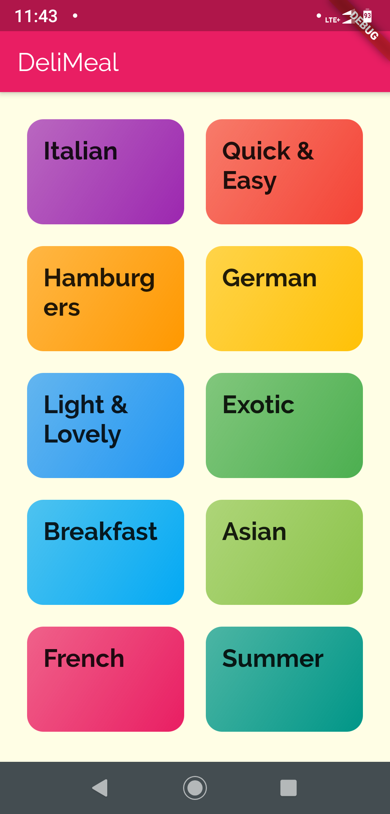
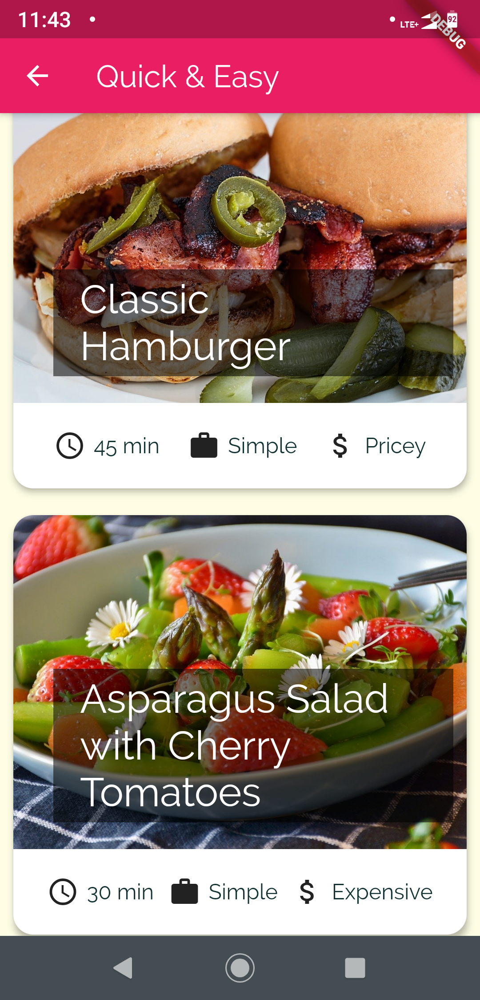
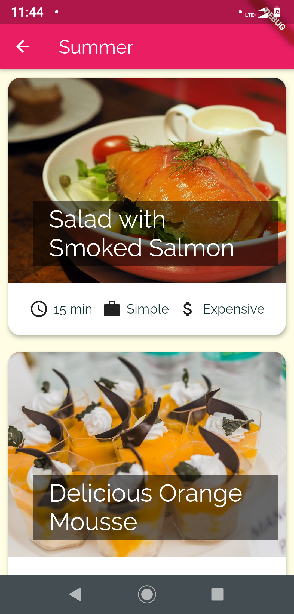
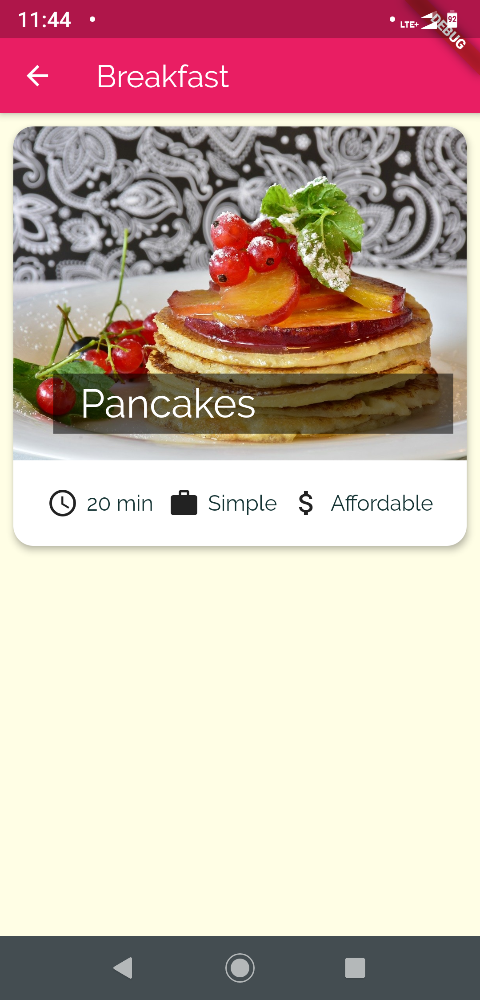

# Meals-App
FRONTEND Mobile Application for Showcase:

2.	Meals App:

•	Built a Frontend Mobile App which has all of my favorite cuisine and respective food items with their Recipes and Extra Information.

•	Special care taken on the look/feel of the Page by using Attractive UI elements.

•	Use of Network Images to fetch the Images from a Particular URL.

•	Use of Class models(OOPS)(Category,Meals) built in Dart to provide a blueprint for the Dummy Data used for making UI elements.

•	Use of Dummy Data in the UI Objects/Widgets from Classes already built.

•	Use of Navigator Class to Move between Pages and setting up routes.

•	Use of Constructor to pass data between Screens.

•	Difficulties Encountered: Lots of trial and Error required on choosing the relevant UI elements.
             
•	Softwares/Frameworks Used: DART(Programming Language),Flutter Framework, Android Studio,    Visual Studio Code, Firebase(NoSQL Database and Tools by Google)

